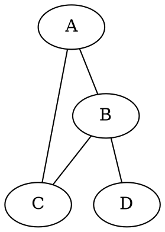
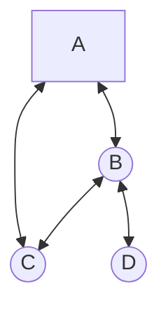
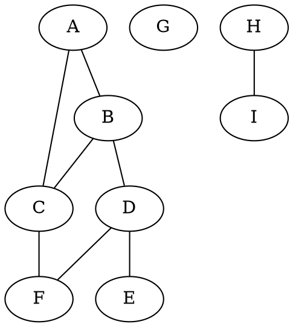

```dot
graph {
        A;
        B;
        C;
        D;
        A -- B;
        A -- C;
        B -- C;
        B -- D;
}
```

```mermaid
graph TD;
    A; B((B)); C((C)); D((D));
    A<-->B;
    A<-->C;
    B<-->C;
    B<-->D;
```

```dot
graph {
        A;
        B;
        C;
        D;
        E;
        F;
        G;
        H;
        I;
        A -- B;
        A -- C;
        B -- C;
        B -- D;
        C -- F;
        D -- F;
        D -- E;
        H -- I;
}
```
